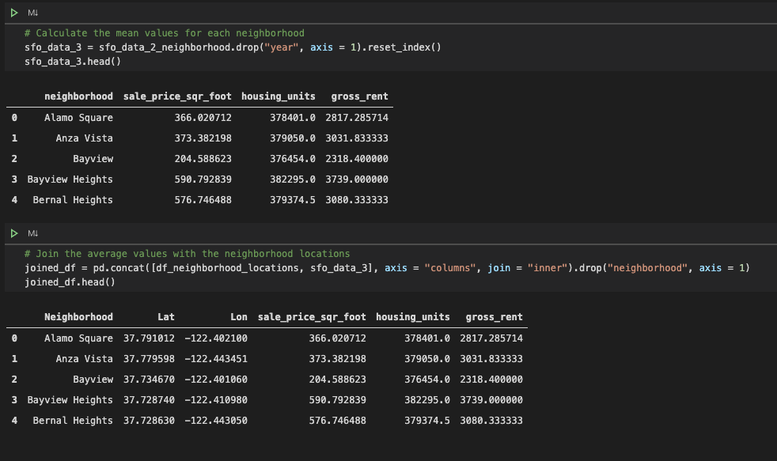

[^1]

# Pythonic_Monopoly

Help customers invest in the San Francisco Real Estate Market using maps, charts and interactive visualizations.

---

## Overview

Harold's company has just started a new Real Estate Investment division to provide customers with a broader range of portfolio options. Harold was tasked with building a prototype dashboard and he needs your help. The real estate team wants to trial this initial offering with investment opportunities for the San Francisco market. If the new service is popular, then they can start to expand to other markets.

---

## Installation

Need everything in the following screenshot

---

## Dashboard Screenshots

---

## Code Screenshots

---

## Contributors

- Asif Meghani

Looking to contribute?
Contact me!

---

## Acknowledgements

Starter code and housing data has been provided by Rice University Trilogy Education Services

---

## Contact Me

linkedin - www.linkedin.com/in/asif-meghani-26a2a719

---

## License

MIT License

---

## Sources

1 San_Fran - https://www.ihg.com/holidayinn/hotels/us/en/san-francisco/sfogg/hoteldetail